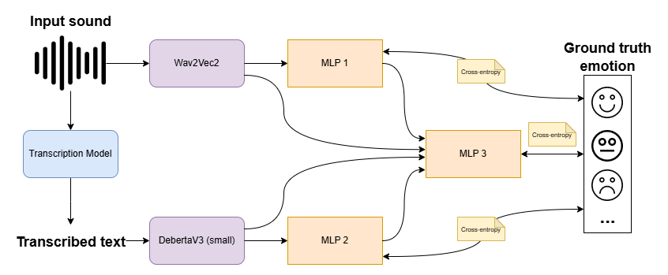

# Multimodal Speech Emotion Recognition

This repository contains the code and resources for the Multimodal SER Model designed to recognize emotions from speech by combining text and acoustic data. The model fine-tunes a Multilayer Perceptron from text features extracted by DeBERTaV3 and another Multilayer Perceptron from acoustic features extracted by Wav2Vec2, then integrates these features through a Multilayer Perceptron (MLP) for improved emotion classification.

## Overview

The Multimodal SER Model leverages both textual and acoustic features to classify emotions more accurately. The architecture consists of:

- **Initial Classification**: Each model (MLP 1, respectively MLP 2) individually classifies the emotion based on their respective features (extracted with Wav2Vec2, respectively DebertaV3).
- **Fusion and Final Classification**: The extracted features and initial predictions are combined using a Multi-Layer Perceptron (MLP 3) to provide the final emotion classification.

A research report detailing the development and evaluation of this architecture can be found at [research-raport.pdf](./research-raport.pdf).



## Setup

1. Clone this repository.
2. Create a virtual python `3.11` environment.
3. Set the python packet manager to version `23.3.1`, using:
   ```bash
   $ pip upgrade --install pip==23.3.1
   ```
4. Install the imported libraries using:
   ```bash
   $ pip install requriements.txt
   ```

## Dataset

The dataset can be downloaded from:

- [kaggle](https://www.kaggle.com/datasets/dejolilandry/iemocapfullrelease) - unofficial version
- [official website](https://sail.usc.edu/iemocap/iemocap_release.htm) - official version, available upon request

## License

This project is licensed under the MIT License - see the [LICENSE](LICENSE) file for details.
